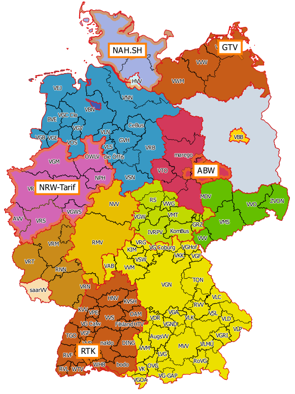
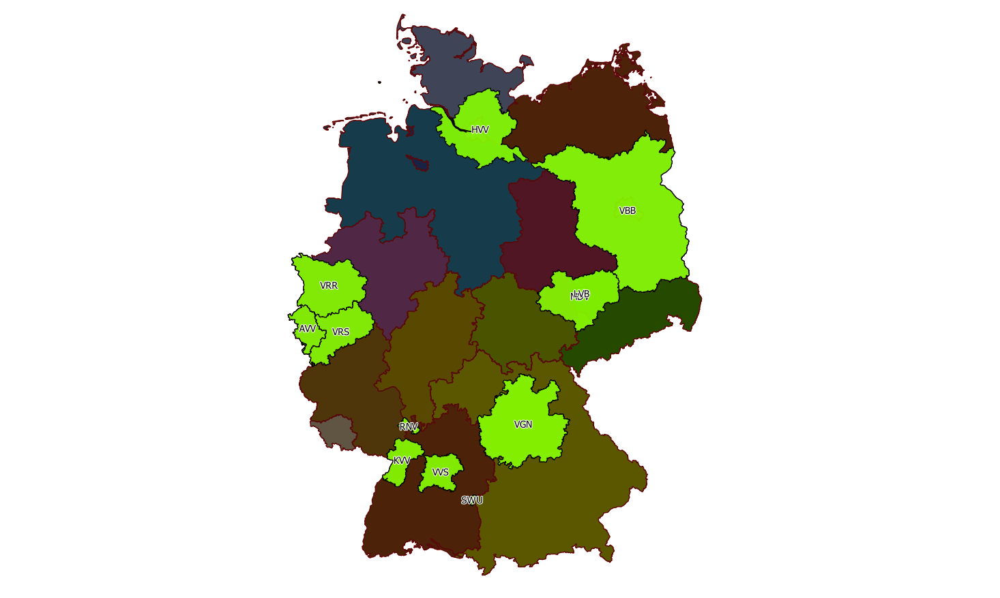

# Karte der Verkehrs- und Tarifverbünde in Deutschland

Dieses Repository stellt die Karte der Verkehrs- und Tarifverbünde in Deutschland bereit.

Es bietet ein [QGIS](http://www.qgis.org/)-Projekt mit Geodaten der Verkehrs- und Tarifverbünde in Vektor-Form (ShapeFiles).

# Übersicht

## Karte der Verkehrs- und Tarifverbünde



## Verfügbarkeit der Fahrpläne



# Einrichtung

Aus lizenztechnischen Gründen wird Teil des Bildmaterials nicht im Repository veröffentlich sonder muss extra herundergeladen und aufbereitet werden.

Das Herunterladen auf Aufbereiten ist erst sehr pragmatisch via Batch-Files gemacht.

## Windows

* [ImageMagick](http://www.imagemagick.org/script/index.php) installieren

```
Verwaltungsgrenzen\download.bat
Verbundkarte\Wikipedia\download.bat
Verbundkarte\Kursbuch\download.bat
Verbundkarte\Kursbuch\crop.bat
Verbundkarte\Kursbuch\append.bat
Verbundkarte\DE\download.bat
Verbundkarte\DE\HE\download.bat
Verbundkarte\DE\SH\download.bat
```

# Lizenz

[CC BY-SA 2.5](https://creativecommons.org/licenses/by-sa/2.5/deed.en)

Wird noch ggf. angepasst.

# Quellen

## [Karte der Verkehrsverbünde und Tarifverbünde in Deutschland](https://commons.wikimedia.org/wiki/File:Karte_der_Verkehrsverb%C3%BCnde_und_Tarifverb%C3%BCnde_in_Deutschland.png)

[Karte der Verkehrsverbünde und Tarifverbünde in Deutschland](https://commons.wikimedia.org/wiki/File:Karte_der_Verkehrsverb%C3%BCnde_und_Tarifverb%C3%BCnde_in_Deutschland.png) von [Maximilian Dörrbecker](https://de.wikipedia.org/wiki/Benutzer:Chumwa) lizenziert unter [CC BY-SA 2.5](https://creativecommons.org/licenses/by-sa/2.5/deed.en).


## [Verwaltungsgebiete 1:1.000.000](http://www.geodatenzentrum.de/geodaten/gdz_rahmen.gdz_div?gdz_spr=deu&gdz_akt_zeile=5&gdz_anz_zeile=1&gdz_unt_zeile=17&gdz_user_id=0)

[Verwaltungsgebiete 1:1.000.000](http://www.geodatenzentrum.de/geodaten/gdz_rahmen.gdz_div?gdz_spr=deu&gdz_akt_zeile=5&gdz_anz_zeile=1&gdz_unt_zeile=17&gdz_user_id=0) © GeoBasis-DE / [BKG](http://www.bkg.bund.de/) 2016.

## [Interaktive Verbundkarte](http://kursbuch.bahn.de/hafas/kbview.exe/dn?rt=1&mainframe=IK_verbund) vom [Elektronischen Kursbuch](http://kursbuch.bahn.de/)

Das Urheberrecht an den Kartendaten liegt bei DB Netz AG, I.NVT 52 (V).